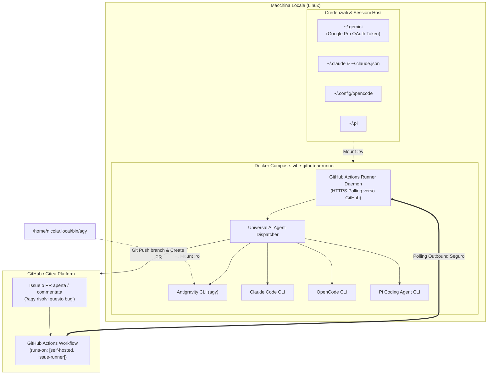

# 🚀 Universal AI Issue Runner (Self-Hosted)

> Un runner Docker multi-agente per **GitHub Actions** e **Gitea Actions** che esegue su questa macchina locale attività di sviluppo agentico autonomo in risposta a comandi su Issue e Pull Request (`/agy`, `/claude`, `/oc`, `/pi`), sfruttando le tue sessioni e sottoscrizioni (incluso **Google Pro per Antigravity**).

---

## 🌟 Caratteristiche Principali

- 🧠 **Multi-Agente Nativo**:
  - **Google Antigravity CLI (`agy`)**: Integrato con la tua sottoscrizione **Google Pro**, zero API key esterne necessarie, token OAuth persistente con rinnovo automatico.
  - **Anthropic Claude Code (`claude`)**: Pronto all'uso con la sessione montata da `~/.claude`.
  - **OpenCode CLI (`opencode`)**: Ispirato all'architettura agentica di `Polisportiva-Maremola/basket`.
  - **Pi Coding Agent (`pi`)**: Agente ReAct con capacità di auto-correzione.
- 🔒 **Zero Porte Aperte o Webhook Pubblici**:
  - I runner comunicano con GitHub/Gitea tramite polling HTTPS in uscita (*outbound*). Funziona istantaneamente dietro NAT, router e firewall domestici senza bisogno di ngrok o Cloudflare Tunnels.
- 🏢 **Multi-Repo & Multi-Organizzazione**:
  - Può essere registrato a livello di **singola repository** oppure a livello di **intera Organization** (servendo tutti i progetti dell'organizzazione con una sola istanza).
  - Supporta anche **Gitea Self-Hosted** come Global Runner.
- 🔄 **Sincronizzazione Credenziali RW**:
  - Le sessioni locali (`~/.gemini`, `~/.claude`, `~/.config/opencode`, `~/.pi`) sono montate in modalità `:rw` in modo che il rinnovo automatico dei token di sessione persista e non scada mai.

---

## 🏗️ Architettura



---

## 🛠️ Come Avviare il Runner

### 1. Clona e configura l'ambiente

```bash
cd /home/nicola/dockerCompose/issue-runner
cp .env.example .env
nano .env
```

Configura i seguenti campi in `.env`:

```ini
# URL del repository o della tua organizzazione GitHub:
GITHUB_URL=https://github.com/vibe-maribit/issue-runner
# Oppure per l'intera organizzazione:
# GITHUB_URL=https://github.com/vibe-maribit

# GitHub Personal Access Token con permessi 'repo' (o 'admin:org'):
GITHUB_PAT=ghp_tuoTokenPersonale

# Nome ed etichette
GITHUB_RUNNER_NAME=vibe-ai-runner-box
GITHUB_RUNNER_LABELS=self-hosted,linux,x64,issue-runner,antigravity,agy,claude,opencode,pi-agent,codex
```

### 2. Costruisci e avvia il container

```bash
# Avvia il runner per GitHub Actions:
docker compose up -d github-runner

# Visualizza i log in tempo reale:
docker compose logs -f github-runner
```

Quando nei log compare:
```
Listening for Jobs
```
Il runner è registrato, online e pronto all'uso! Puoi verificarlo anche su GitHub in **Settings > Actions > Runners**.

---

## 🎯 Come Usarlo nei Tuoi Repository

Copia uno dei workflow pronti dalla cartella `templates/workflows/` nella cartella `.github/workflows/` del tuo progetto:

| File Template | Descrizione | Trigger Comandi |
|---|---|---|
| [`universal-ai-runner.yml`](templates/workflows/universal-ai-runner.yml) | **Consigliato**: Supporta tutti gli agenti in un unico workflow | `/agy`, `/claude`, `/oc`, `/pi` |
| [`antigravity.yml`](templates/workflows/antigravity.yml) | Focalizzato su Google Antigravity CLI e Google Pro | `/agy`, `/antigravity` |
| [`claude.yml`](templates/workflows/claude.yml) | Focalizzato su Anthropic Claude Code | `/claude` |
| [`opencode.yml`](templates/workflows/opencode.yml) | Focalizzato su OpenCode CLI | `/oc`, `/opencode` |
| [`pi-agent.yml`](templates/workflows/pi-agent.yml) | Focalizzato su Pi Coding Agent | `/pi` |

### Esempio di utilizzo su GitHub:
In una qualunque Issue o PR del tuo repository, scrivi semplicemente:

```markdown
/agy sistema il padding della navbar sui dispositivi mobili e verifica con i test
```
oppure:
```markdown
/claude implementa il dark mode toggle
```
oppure:
```markdown
/oc aggiungi il rate limit per l'endpoint di login
```

L'agente:
1. Reagirà subito al tuo commento con un'emoji 👀.
2. Scaricherà il codice sul tuo computer locale all'interno del container.
3. Modificherà i file necessari e lancerà i test di verifica.
4. Creerà un nuovo branch (es. `ai/issue-12-agy`).
5. Aprirà automaticamente una Pull Request con il riassunto delle modifiche e reagirà con 🚀!

---

## 🦊 Supporto Gitea Self-Hosted

Se vuoi usare il runner anche per un'istanza Gitea locale o remota:

1. Configura le variabili Gitea in `.env`:
   ```ini
   GITEA_INSTANCE_URL=https://gitea.example.com
   GITEA_RUNNER_TOKEN=tuoTokenGitea
   ```
2. Avvia il runner di Gitea:
   ```bash
   docker compose up -d gitea-runner
   ```
3. Il runner sarà registrato come **Global Runner** ed eseguirà i file `.gitea/workflows/*.yml` per tutti i progetti dell'istanza!

---

## 🧪 Diagnostica Locale

Per testare che tutti gli agenti e le credenziali rispondano correttamente all'interno dell'ambiente:

```bash
docker compose exec github-runner /home/runner/actions-runner/scripts/test-agents.sh
```
